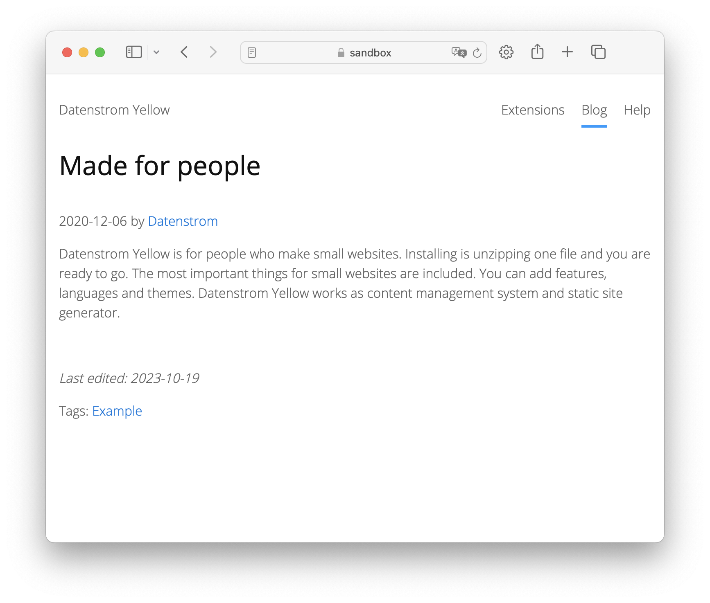

# Lastedit 0.8.18

Shows the last modification date.

## How to install the extension

[Download ZIP file](https://github.com/pftnhr/yellow-lastedit/archive/refs/heads/main.zip) and copy it into your `system/extensions` folder. [Learn more about extensions](https://github.com/annaesvensson/yellow-update).

## How to show the last modification date.

Create a paragraph that shows the last modification date if it is at least one day after publishing date.

This extensions outputs following HTML code:

     
    
<em>Last edited: YYYY-MM-DD</em>

The date format depends on your settings in `yellow-system.ini`.

## Examples

`lastedit` as shortcut

    [lastedit]

`lastedit` with custom text

    [lastedit "Custom text"]

You can also integrate it in your layout files with

    <?php echo $this->yellow->page->getExtraHtml("lastedit") ?>

## Settings

The following setting can be configured in file `system/extensions/yellow-language.ini`:

    LasteditText = default text

## Developer

Robert Pfotenhauer. [Get help](https://datenstrom.se/yellow/help/).

